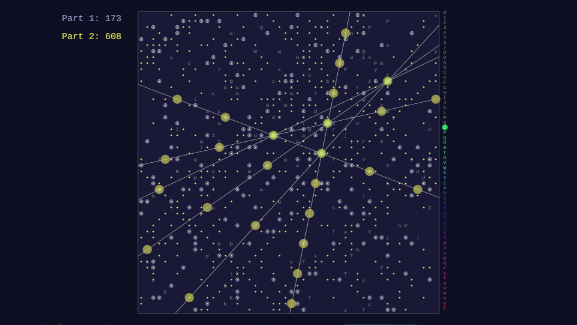

# Advent of Code 

My python solutions for [Advent Of Code](https://adventofcode.com) tasks. 

I did some puzzles from 2015 to warm up for 2023. Check out my [2022 repo](https://github.com/gereleth/AdventOfCode2022) too. 

## Prerequisites

I ran this code on python 3.10.8. It might work on other python 3 versions too.

Create a virtual environment and install dependencies.

```
python -m venv venv
source venv/bin/activate
pip install -r requirements.txt
```

## Layout

Code for each day is in `src/year{y}/day{d}.py`.

Inputs use [`advent-of-code-data`](https://pypi.org/project/advent-of-code-data/) library.
Export `AOC_SESSION` environment variable to get your own inputs.
I also export `AOC_DATA` to put input files into a folder here.

```bash
# env.sh
export AOC_SESSION=cafef00db01dfaceba5eba11deadbeef
export AOC_DATA=/path/to/this/folder/data
```

## Usage

Solve all tasks from a year:

```bash
python src/solve.py --year {year}
```

Solve particular day:

```bash
python src/solve.py --year {year} --day {day}
```

Other options:

- `--year {year} --day {day} --input {filepath}` - run on a specified input file

## Animations

Some days include code to produce animations illustrating the solution.

You can see them by running

```bash
python src/vis.py --year {year} --day {day}
```

### 2024

Animations made with py5. I'm adding videos to this [youtube playlist](https://www.youtube.com/playlist?list=PLo8XMPR0L8PeHbxb70MJqsCd_hETOFbI9). Click an image to watch that video.

<table>
    <tr>
        <td>
            <h4><a href="src/year2024/day01vis.py">Day 1</a></h4>
            <a href="https://youtu.be/MIOsQXBrSvU" target="_blank" rel="noopener"></a>
        </td>
        <td>            
            Day 2
        </td>
        <td>
            <h4><a href="src/year2024/day03vis.py">Day 3</a></h4>
            (needs upload)
        </td>
    </tr>
    <tr>
        <td>
            <h4><a href="src/year2024/day04vis.py">Day 4</a></h4>
            (needs upload)
        </td>
        <td>        
            Day 5
        </td>
        <td>
            <h4><a href="src/year2024/day06vis.py">Day 6</a></h4>
            (needs upload)
        </td>
    </tr>
    <tr>
        <td>
            Day 7
        </td>
        <td>  
            <h4><a href="src/year2024/day08vis.py">Day 8</a></h4>
            <a href="https://youtu.be/OKk7IBs2s_k" target="_blank" rel="noopener"></a>
        </td>
        <td>
        <h4><a href="src/year2024/day09vis.py">Day 9</a></h4>
            <a href="https://youtu.be/ioMh6Ir7ZZs" target="_blank" rel="noopener"></a>
        </td>
    </tr>
    <tr>
        <td>
            <h4><a href="src/year2024/day10vis.py">Day 10</a></h4>
            <a href="https://youtu.be/2kjX5DxUANc" target="_blank" rel="noopener"></a>
        </td>
        <td>
            Day 11
        </td>
        <td>
            Day 12
        </td>
    </tr>
    <tr>
        <td>
            Day 13
        </td>
        </td>
        <td>
            <h4><a href="src/year2024/day14vis.py">Day 14</a></h4>
            (needs upload)
        </td>
        <td>
            <h4><a href="src/year2024/day15vis.py">Day 15</a></h4>
            (needs upload)
        </td>
    </tr>
    <tr>
        <td>
            <h4><a href="src/year2024/day16vis.py">Day 16</a></h4>
            (needs upload)
        </td>
        </td>
        <td>
            Day 17
        </td>
        <td>
            <h4><a href="src/year2024/day18vis.py">Day 18</a></h4>
            (needs upload)
        </td>
    </tr>
</table>

### 2023

Animations made with pygame. I'm adding videos to this [youtube playlist](https://www.youtube.com/playlist?list=PLo8XMPR0L8PcIiGtLllA7r3llWXHP3I_7). Click an image to watch that video.

<table>
    <tr>
        <td>
            <h4><a href="src/year2023/day01vis.py">Day 1</a></h4>
            <a href="https://youtu.be/9hk2N5j0_YE" target="_blank" rel="noopener"></a>
        </td>
        <td>            
            <h4><a href="src/year2023/day02vis.py">Day 2</a></h4>
            <a href="https://youtu.be/kaY-e_vGzg4" target="_blank" rel="noopener"></a>
        </td>
        <td>
            <h4><a href="src/year2023/day03vis.py">Day 3</a></h4>
            <a href="https://youtu.be/6he5Wah7WBg" target="_blank" rel="noopener"></a>
        </td>
    </tr>
    <tr>
        <td>
            <h4><a href="src/year2023/day04vis.py">Day 4</a></h4>
            <a href="https://youtu.be/CzSTY_7OMws" target="_blank" rel="noopener"></a>
        </td>
        <td>        
            <h4><a href="src/year2023/day05vis.py">Day 5</a></h4>
            <a href="https://youtu.be/noSUwk0vDqQ" target="_blank" rel="noopener"></a>    
        </td>
        <td>
            <h4><a href="src/year2023/day06vis.py">Day 6</a></h4>
            <a href="https://youtu.be/cMvW4DCkeoc" target="_blank" rel="noopener"></a>  
        </td>
    </tr>
    <tr>
        <td>
            <h4><a href="src/year2023/day07vis.py">Day 7</a></h4>
            <a href="https://youtu.be/I8h9GvjeJ8g" target="_blank" rel="noopener"></a>
        </td>
        <td>  
            <h4><a href="src/year2023/day08vis.py">Day 8</a></h4>
            <a href="https://youtu.be/76pq7DGtRfE" target="_blank" rel="noopener"></a>
        </td>
        <td>
            <h4>Day 9</a></h4>
            (no vis for now)
        </td>
    </tr>
        <tr>
        <td>
            <h4><a href="src/year2023/day10vis.py">Day 10</a></h4>
            <a href="https://youtu.be/bKFK0A10yi4" target="_blank" rel="noopener"></a>
        </td>
        <td>
            <h4><a href="src/year2023/day11vis.py">Day 11</a></h4>
            <a href="https://youtu.be/zbFeoUQiC9E" target="_blank" rel="noopener"></a>
        </td>
        <td>
            <h4>Day 12</a></h4>
            (what do I even show?..)
        </td>
    </tr>
    <tr>
        <td>
            <h4>Day 13</a></h4>
            (should be doable)
        </td>
        <td>
            <h4><a href="src/year2023/day14vis.py">Day 14</a></h4>
            <a href="https://youtu.be/DY3gP2WB-oo" target="_blank" rel="noopener"></a>
        </td>
        <td>            
        <h4>Day 15</a></h4>
            (not as interesting)
        </td>
    </tr>
    <tr>
        <td>
            <h4><a href="src/year2023/day16vis.py">Day 16</a></h4>
            <a href="https://youtu.be/on7ic1wlp7A" target="_blank" rel="noopener"></a>
        </td>
        <td>
            <h4><a href="src/year2023/day17vis.py">Day 17</a></h4>
            <a href="https://youtu.be/GhkrkVj8ODk" target="_blank" rel="noopener"></a>
        </td>
        <td>
            <h4>Day 18</a></h4>
            (no vis yet)
        </td>
    </tr>
    <tr>
        <td>
            <h4><a href="src/year2023/day19vis.py">Day 19</a></h4>
            <a href="https://youtu.be/WqCZB9lt1vI" target="_blank" rel="noopener"></a>
        </td>
        <td>
            <h4>Day 20</a></h4>
        </td>
        <td>
            <h4>Day 21</a></h4>
        </td>
    </tr>
    <tr>
        <td>
            <h4>Day 22</a></h4>
        </td>
        <td>
            <h4>Day 23</a></h4>
        </td>
        <td>
            <h4>Day 24</a></h4>
        </td>
    </tr>
    <tr>
        <td>
            <h4>Day 25</a></h4>
        </td>
        <td>
        </td>
        <td>
        </td>
    </tr>
</table>
